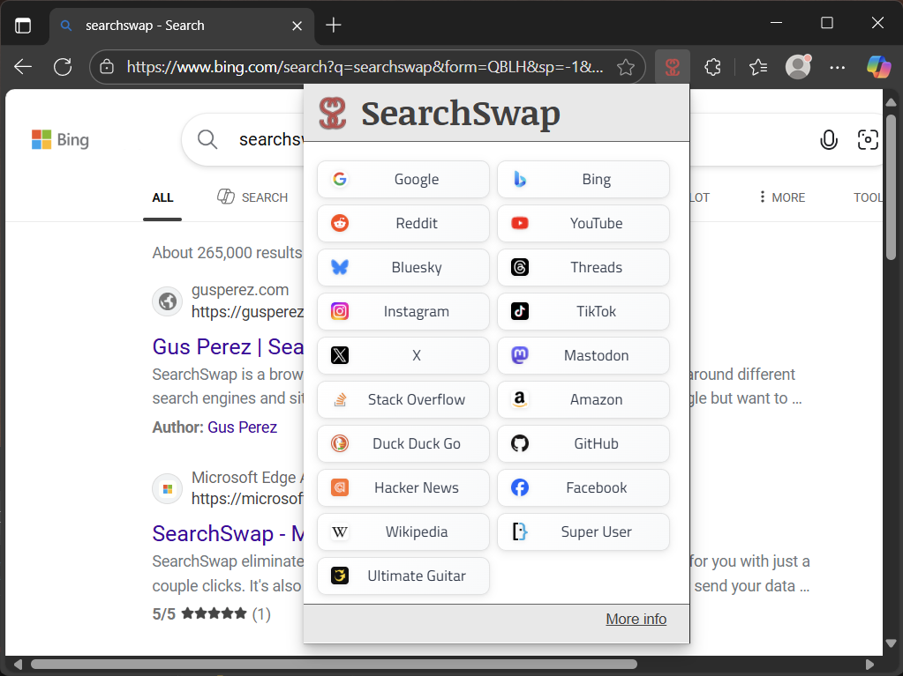

# SearchSwap
Minimal and super simple browser extension for Google Chrome and Microsoft Edge that makes it easy to search for something across different search engines and sites.

## Install
* [Chrome](https://chrome.google.com/webstore/detail/searchswap/meakfdkjiehkccdibhahjlgnihicmlel)
* [Edge](https://microsoftedge.microsoft.com/addons/detail/searchswap/mhegncmnkpdckdpomfmedhflbfdkfpie)

## Changelog
See [CHANGELOG.md](CHANGELOG.md) for version history and updates.

## More info
* [GusPerez.com/SearchSwap](https://gusperez.com/searchswap/)

## Attributions

This project uses the following open source resources:

### Fonts
- **Google Fonts** - [Titillium Web](https://fonts.google.com/specimen/Titillium+Web) and [Noticia Text](https://fonts.google.com/specimen/Noticia+Text)
  - Licensed under the [SIL Open Font License](https://scripts.sil.org/cms/scripts/page.php?site_id=nrsi&id=OFL)
  - Used for extension UI typography

### Browser APIs
- **Chrome Extensions API** - Provided by Google for browser extension functionality
- **WebExtensions API** - Cross-browser extension standard used for Chrome and Edge compatibility